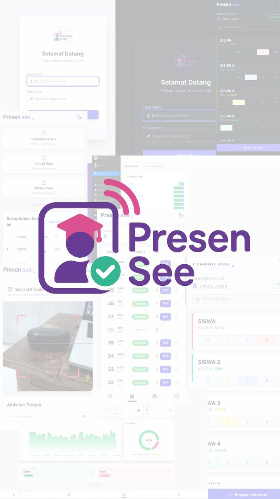
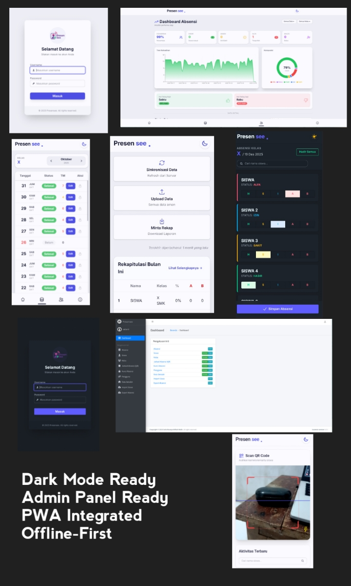

## ⚠️ PERINGATAN

_Software ini GRATIS_

- ✅ **Diperbolehkan:** Penggunaan pribadi atau instansi internal.
- ❌ **Dilarang:** Menjual software ini atau menggunakannya untuk tujuan komersil tanpa izin.

---

# **Presensee 📱**



> **Sistem Absensi Modern dengan Arsitektur Offline-First — cepat, ringan, dan tetap jalan meskipun tanpa internet.**

[](https://www.djangoproject.com/)
[](https://react.dev/)
[](https://vitejs.dev/)
[](https://tailwindcss.com/)
[](https://github.com/astral-sh/uv)
[](https://bun.sh/)

**Presensee** adalah aplikasi **(web based)** absensi siswa untuk sekolah yang dirancang dengan arsitektur **Offline-First**. Antarmuka dibuat interaktif agar memudahkan proses absensi.

Dibangun menggunakan stack modern: **Django** di backend, **React (Vite)** di frontend.



---

## 🌟 Fitur Utama

- 📡 **Offline-First:** Absensi tetap bisa di-input tanpa internet. Sinkronisasi dilakukan nanti saat online.
- 👥 **Role-Based Access:**

  - **Sekretaris** → Input absensi harian.
  - **Wali Kelas** → Monitoring, kunci absensi, dan lihat rekap.
  - **Kesiswaan** → Lihat rekap seluruh kelas.
  - **Guru Piket** → Melakukan absensi siswa menggunakan QRCode.
  - **Admin** → Full Power.

- 📊 **Rekap Pintar:** Filter otomatis berdasarkan Bulan, Minggu, atau Rentang Tanggal.
- 📄 **Export & Share:** Generate laporan bulanan + fitur _native share_ (WhatsApp/Telegram).
- 🎨 **UI Modern & Responsif** dengan dukungan Dark/Light Mode.

---

## 🛠️ Requirements

1. **[uv](https://docs.astral.sh/uv/)** – Python Package Manager.
2. **[Bun](https://bun.com/)** – Untuk build frontend.
3. **[PostgreSQL Server](https://codingstudio.id/blog/postgresql-adalah/)** atau **[MySQL Server](https://www.mysql.com/)** – Database utama.
4. **[Redis Server](https://redis.io/)** – Caching.
5. **[Git](https://git-scm.com/)** – Untuk download project.
6. **[wkhtmltopdf](https://wkhtmltopdf.org/)** – Export laporan ke PDF.

---

## 🚀 Instalasi

### 1. Clone Repository

```bash
git clone https://github.com/salismazaya/presensee-public.git
cd presensee-public
```

---

### 2. Setup Backend (Django)

Masih di folder utama:

```bash
# Install python
uv python install

# Install dependencies backend
uv sync

# Setup environment variables
cp .env.example .env
```

---

### 3. Setup Frontend (React + Vite)

```bash
cd frontend

# Install deps
bun install

# Build assets
bun run build

cd ..
```

---

## ⚡ Menjalankan Aplikasi

Jalankan server menggunakan Granian:

```bash
uv run granian --interface wsgi django_project.wsgi:application --env-files .env
```

Akses melalui: **[http://127.0.0.1:8000](http://127.0.0.1:8000)** (atau sesuai config Anda).<br>
Buka **[http://127.0.0.1:8000/setup](http://127.0.0.1:8000/setup)** untuk setup awal.<br><br>

Baca lebih lanjut tentang **[Granian](https://github.com/emmett-framework/granian)**

---

## 👥 Kredit

Crafted with ❤️ by **[Salis Mazaya](https://mazaya.is-a.dev)**

---
